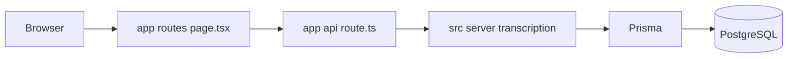

# SubtitleBot — Estrutura do repositório

Documento para contexto de ferramentas (Claude, etc.): **pastas, responsabilidades e ficheiros-chave**. Monorepo com a aplicação principal em **`web/`** (Next.js App Router).

---

## 1. Visão geral

| Aspeto | Detalhe |
|--------|---------|
| App principal | Next.js 16 (App Router), React, Tailwind 4 |
| API | Route Handlers em `web/app/api/**/route.ts` |
| Base de dados | PostgreSQL + Prisma 7 (`web/prisma/`) |
| Cliente Prisma gerado | `web/app/generated/prisma` (output definido no `schema.prisma`) |
| Raiz `SubtitleBot/` | Scripts npm que delegam para `web/`, Docker, docs, mockups HTML |

**Comandos úteis (na raiz):** `npm run dev`, `npm run build`, `npm run db:migrate`, `npm run db:up` (PostgreSQL via Docker).

---

## 2. Convenções App Router (resumo)

| Ideia | Onde |
|--------|------|
| **UI + rotas + API HTTP** | `web/app/` — páginas (`page.tsx`), layouts, e **Route Handlers** em `app/api/**/route.ts`. |
| **Servidor e domínio reutilizável** | `web/src/` — sobretudo `src/server/` (transcrição, jobs) e `src/lib/` (Prisma, SRT, etc.). |
| **API “fina”** | Rotas importam serviços; lógica pesada **não** fica duplicada dentro de `route.ts` — alinhar com `src/server/transcription/` e similares. |
| **CSS por feature** | Ficheiros como [`web/app/projetos/projetos.css`](web/app/projetos/projetos.css), `editor.css`, `waveform.css` — evita um único `globals.css` gigante. |
| **Hooks do editor** | A maior parte vive em [`web/app/subtitle-file-edit/hooks/`](web/app/subtitle-file-edit/hooks/) (isolados por domínio da feature). |

---

## 3. Árvore resumida

```
SubtitleBot/
├── web/                    # Aplicação Next.js (código principal)
├── ml-pipeline/            # Scripts Python / datasets / pipelines (não é a UI Next; antigo `Frontend/`)
├── docker-compose.yml
├── package.json            # Atalhos → npm --prefix web
├── ORGANIZACAO_PROJETO.txt # Resumo legado (alto nível)
├── ARCHITECTURE.md, PIPELINE-*.md, COMPONENTES_INVENTARIO.txt
├── *.html                  # Mockups / referência visual
└── ESTRUTURA_REPOSITORIO.md # Este ficheiro
```

```
web/
├── app/                    # Rotas, layout, API colocalizada, CSS global da app
├── components/             # UI partilhada fora de uma rota única (ex.: batch do gerador)
├── hooks/                  # Hooks à raiz do pacote (ex.: use-debounce usado por Projetos)
├── lib/                    # Utilitários à raiz (ex.: openai-api-key-storage, partilhado com gerador)
├── prisma/                 # schema.prisma + migrations/
├── public/                 # Estáticos
├── scripts/                # Scripts auxiliares (build, etc.)
├── src/                    # Lógica de servidor e domínio (fora das rotas)
├── middleware.ts
├── next.config.ts
├── package.json
└── vitest.config.ts
```

---

## 4. Raiz `SubtitleBot/`

| Caminho | Função |
|---------|--------|
| `package.json` | Encaminha `dev`, `build`, `lint`, `db:*` para `web/` |
| `docker-compose.yml` | Serviço PostgreSQL (e o que mais estiver definido) |
| `ORGANIZACAO_PROJETO.txt` | Descrição textual da organização (pode estar desatualizada face ao código) |
| `ARCHITECTURE.md`, `PIPELINE-TRANSCRICAO.md`, `PIPELINE-STATUS-ATUALIZADO.md` | Documentação de arquitetura / pipeline |
| `COMPONENTES_INVENTARIO.txt` | Inventário de componentes |
| `design-system.html`, `srt_generator_mockup.html`, `projects-page-reference.html` | Referências HTML / mockups |
| `ml-pipeline/` | **Não** é a app Next: scripts Python, datasets, pipelines de legendas (ver [secção 15](#15-pastas-que-confundem); pasta antiga `Frontend/`). |

---

## 5. `web/app/` — App Router (UI + API)

### 5.1 Ficheiros globais

| Ficheiro | Função |
|----------|--------|
| `layout.tsx` | Layout raiz (fontes, `AppShell`, `globals.css`) |
| `page.tsx` | Página inicial `/` |
| `globals.css` | Import Tailwind, tokens, `shell.css`, estilos globais (incl. inputs de data e tema do date picker) |
| `design-system.css` | Tokens CSS (`:root`), reset em `@layer base`, componentes `.btn`, etc. |
| `favicon.ico` | Ícone |

### 5.2 `app/components/` — Shell e UI transversal

Componentes reutilizados por várias rotas (navegação, layout de página):

- **`app-shell.tsx`** — Grid sidebar + `<main>` (área de conteúdo).
- **`sidebar-nav.tsx`** — Links da sidebar (Gestão, Editor, etc.).
- **`page-shell.tsx`** — Topbar (título, badge de secção opcional, `UserMenu`), `toolbar` opcional, área scrollável.
- **`user-menu.tsx`** — Menu do utilizador (avatar, dropdown).
- **`date-input.tsx`** — Seletor de data com calendário (`react-day-picker`), alinhado ao design system; reutilizável em drawers/formulários.
- Outros: `hash-scroll.tsx`, contextos de sidebar, etc.

### 5.3 Rotas por pasta (`app/<rota>/page.tsx`)

| Rota | Pasta | Notas |
|------|-------|--------|
| `/` | `page.tsx` (raiz `app/`) | Landing / redirect conforme implementação |
| `/projetos` | `projetos/` | Gestão de **DubbingProject** (KPIs, filtros, tabela, drawer) |
| `/gerar` | `gerar/` | Gerador SRT em lote (ZIP, jobs, chave OpenAI) |
| `/subtitle-file-edit` | `subtitle-file-edit/` | **Editor de legendas** (waveform, cues, maior volume de código) |
| `/configuracoes` | `configuracoes/` | Configurações |
| `/elenco`, `/agenda` | `elenco/`, `agenda/` | Placeholders / em construção (se existirem) |

Subpastas típicas dentro de uma feature:

- `components/` — UI só dessa rota
- `lib/` — helpers locais
- `hooks/` — hooks só do editor ou da feature
- `*.css` — estilos escopados (ex.: `projetos.css`)

### 5.4 `app/api/` — REST (Route Handlers)

Cada `route.ts` exporta métodos HTTP. Organização por **domínio**:

| Prefixo | Domínio |
|-----------|---------|
| `api/projects/[id]/...` | Projeto de **transcrição** (Prisma `Project`): cues, media, export SRT, transcriptions |
| `api/subtitle-files/[id]/...` | Ficheiro de legenda: CRUD, áudio, export, versões |
| `api/subtitle-cues/...` | Atualização em bulk de cues |
| `api/cues/...` | Cue individual ou batch |
| `api/jobs/[jobId]/...` | **TranscriptionJob**: estado, retry, reprocess-normalization |
| `api/batch-jobs/[batchId]/...` | **BatchJob**: ficheiros, start, download ZIP, jobs filhos, retry |
| `api/dubbing-projects/...` | **DubbingProject** (gestão / projetos na UI “Projetos”) |

Convém tratar **dois “tipos” de projeto** no modelo mental — ver [glossário (secção 17)](#17-glossário-prisma-project-vs-dubbingproject).

---

## 6. `web/components/` (fora de `app/`)

Componentes React **não** amarrados a uma única rota:

| Caminho | Função |
|---------|--------|
| `components/batch/*` | UI do gerador em lote: `JobsTable`, `ConfigModal`, `BatchStatusBar`, CSS `batch-generator.css`, hooks `useBatchPolling`, tipos e formatação. **Consumido sobretudo por** [`app/gerar/page.tsx`](web/app/gerar/page.tsx); colocation em `app/gerar/components/` é melhoria opcional (ver [backlog](#18-melhorias-opcionais-backlog)). |

---

## 7. `web/hooks/` e `web/lib/` (raiz do pacote `web`)

| Caminho | Função (estado atual) |
|---------|------------------------|
| [`web/hooks/use-debounce.ts`](web/hooks/use-debounce.ts) | Debounce genérico (ex.: Projetos). Não confundir com dezenas de hooks em `app/subtitle-file-edit/hooks/`. |
| [`web/lib/openai-api-key-storage.ts`](web/lib/openai-api-key-storage.ts) | Armazenamento de chave OpenAI no cliente; alinhado ao fluxo do gerador. |

Se no futuro a convenção for “tudo partilhado em `app/hooks/` ou `lib/hooks/`”, pode consolidar-se — não é urgente.

---

## 8. `web/src/` — Servidor e domínio

Código partilhado pelas **API routes** e testes — manter rotas **finas** e lógica aqui.

| Caminho | Função |
|---------|--------|
| `src/lib/prisma.ts` | Cliente Prisma singleton |
| `src/lib/srt/` | Parse / format / tempo SRT |
| `src/lib/project/match-episodes.ts` | Matching de episódios |
| `src/server/transcription/` | Pipeline: jobs, normalização, adapters (Whisper, mock), storage, repositórios |
| `src/server/subtitle-file-queries.ts`, `prisma-errors.ts`, `demo-user.ts` | Queries e helpers de servidor |
| `src/types/` | Tipos partilhados (`project.ts`, `subtitle.ts`) |

---

## 9. `web/prisma/`

| Ficheiro | Função |
|----------|--------|
| `schema.prisma` | Modelos: `User`, `Project`, `SubtitleFile`, `SubtitleCue`, `TranscriptionJob`, `BatchJob`, `SubtitleVersion`, `DubbingProject`, enums |
| `migrations/` | Migrações SQL versionadas |

---

## 10. `web/app/styles/`

CSS adicional importado via `globals.css` ou páginas:

- `shell.css` — Layout sidebar + `.app-main`
- `editor.css`, `waveform.css`, `mvp.css` — Editor / MVP

---

## 11. `web/app/generated/`

- **`prisma/`** — Cliente Prisma gerado (não editar à mão; vem do `prisma generate`).

---

## 12. Tipos partilhados em `app/types/`

| Ficheiro | Uso típico |
|----------|------------|
| [`web/app/types/dubbing-project.ts`](web/app/types/dubbing-project.ts) | DTOs / tipos do domínio Dubbing; também reexport em [`web/app/projetos/types.ts`](web/app/projetos/types.ts). **Opcional:** fundir só em `projetos/types` se deixar de ser usado noutros sítios (ver backlog). |

---

## 13. Configuração e tooling (`web/`)

| Ficheiro | Função |
|----------|--------|
| `next.config.ts` | Next.js (proxy, limites de body, etc.) |
| `middleware.ts` | Middleware Next (nome pode evoluir para convenção “proxy” em versões recentes) |
| `tsconfig.json` | Paths TypeScript |
| `eslint.config.mjs` | ESLint |
| `postcss.config.mjs` | PostCSS / Tailwind |
| `vitest.config.ts` | Testes unitários |
| `.env` / `.env.example` | Variáveis de ambiente (DB, chaves API) |

---

## 14. Fluxo de dados (resumo)



---

## 15. Pastas que confundem

| Nome | Realidade |
|------|-----------|
| **`ml-pipeline/`** (raiz do repo) | Antes **`Frontend/`** (nome confuso com “frontend” da app). Contém scripts Python, datasets e pipelines de legendas — **não** é a UI Next; a app está só em **`web/`**. |
| **`web/`** | Única pasta da **SPA Next.js** (UI + API + `src/` de servidor). |

---

## 16. Parecer técnico: boas práticas já alinhadas

- **Separação `app/` (UI + rotas) vs `src/` (servidor + domínio)** — padrão adequado ao App Router.
- **API fina** — lógica pesada em `src/server/transcription/`, não nas rotas.
- **`PageShell` + `UserMenu`** em `app/components/` — componentes transversais no sítio certo.
- **CSS por feature** (`projetos.css`, `editor.css`, `waveform.css`) — evita globals excessivos.
- **`subtitle-file-edit/hooks/`** — hooks do editor agrupados na feature.
- **Prisma** em [`web/src/lib/prisma.ts`](web/src/lib/prisma.ts) como singleton — correto.
- **`ml-pipeline/`** na raiz (antigo `Frontend/`) — nome alinhado ao conteúdo (Python/ML), reduz confusão com `web/`.
- **Componentização** — tabelas/drawers (ex.: Projetos) e waveform já partidas em subcomponentes; **`project-drawer.tsx`** pode virar secções reutilizáveis quando existirem drawers semelhantes (Elenco/Agenda).

### 16.1 Estado verificado (referência)

| Tópico | Estado no repo |
|--------|----------------|
| `DateInput` em `app/components/` | [`web/app/components/date-input.tsx`](web/app/components/date-input.tsx) |
| `web/hooks/` vs editor | Só `use-debounce` na raiz; editor com muitos hooks em `app/subtitle-file-edit/hooks/` |
| `web/lib/` | `openai-api-key-storage.ts` (partilhado com gerador) |
| `components/batch` | [`web/components/batch/`](web/components/batch); importado por `app/gerar/page.tsx` |
| Tipos Dubbing | [`app/types/dubbing-project.ts`](web/app/types/dubbing-project.ts) + reexport em [`app/projetos/types.ts`](web/app/projetos/types.ts) |

---

## 17. Glossário: Prisma `Project` vs `DubbingProject`

| Modelo | Domínio | Liga a |
|--------|---------|--------|
| **`Project`** | Projeto **técnico** de transcrição / legenda | `SubtitleFile`, `TranscriptionJob`, etc. — API sob `api/projects/...`. |
| **`DubbingProject`** | Projeto de **negócio** / gestão de dublagem (UI Projetos) | Campos de cliente, prazo, idioma, valores — API `api/dubbing-projects/...`. |

**Nota:** o nome `Project` é genérico e confunde com “projeto” no dia a dia. Renomear no Prisma para algo como `TranscriptionProject` seria **migração grande** (tabela, FKs, código). Tratar como decisão futura; até lá, documentar sempre qual modelo uma feature usa.

---

## 18. Melhorias opcionais (backlog)

Não bloqueiam desenvolvimento; implementar em PRs dedicados com `npm run build` e revisão de imports.

| Ideia | Detalhe |
|-------|---------|
| Colocation do batch | Mover [`web/components/batch/`](web/components/batch) → `app/gerar/components/batch/` (ou `app/gerar/_components/`) e atualizar imports em [`gerar/page.tsx`](web/app/gerar/page.tsx). |
| Hooks partilhados | Avaliar mover `web/hooks/use-debounce` para `app/hooks/` ou `lib/hooks/` para uma convenção única de “shared hooks”. |
| Tipos só Projetos | Fundir `app/types/dubbing-project.ts` em `app/projetos/types.ts` (ou `projetos/types/`) e ajustar [`api/dubbing-projects/serialize.ts`](web/app/api/dubbing-projects/serialize.ts) se o DTO for exclusivo desse domínio. |
| Editor em crescimento | Quando `subtitle-file-edit/hooks/` crescer mais, subpastas por domínio (`playback/`, `cues/`, `waveform/`). |
| Drawers semelhantes | Extrair secções de [`project-drawer.tsx`](web/app/projetos/components/project-drawer.tsx) para componentes reutilizáveis quando Elenco/Agenda tiverem formulários paralelos. |

---

## 19. Documentação relacionada no repo

- `ORGANIZACAO_PROJETO.txt` — visão compacta (pode sobrepor-se parcialmente a este doc)
- `web/README.md` — instruções específicas do pacote `web`, se existirem
- `ARCHITECTURE.md`, `PIPELINE-*.md` — decisões de pipeline e arquitetura

---

*Gerado com base na estrutura do repositório; atualizar quando pastas ou domínios mudarem.*
